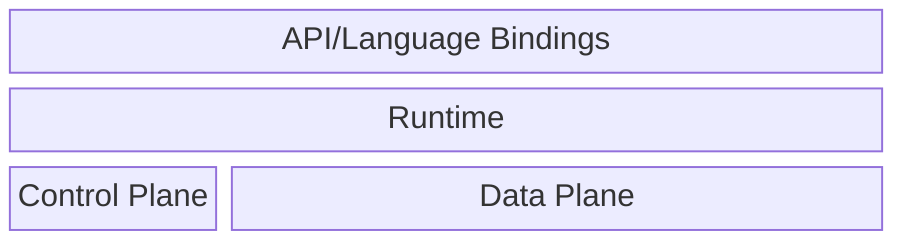

# Architecture

This document describes the high-level software architecture of `tailscale-rs` down to the level of individual crates.
You shouldn't need this document to build applications with `tailscale-rs`! This information is intended for
maintainers and anyone who wants to understand or modify the internals.

We assume basic familiarity with the concepts and terminology behind Tailscale and tailnets, especially:
- The [control plane](https://tailscale.com/docs/concepts/control-data-planes#control-plane) (also called "coordination server" or "control server") and [data plane](https://tailscale.com/docs/concepts/control-data-planes#data-plane)
- [Access Control Lists (ACLs)/grants](https://tailscale.com/docs/reference/grants-vs-acls)
- [Overlay networks](https://tailscale.com/docs/reference/glossary#overlay-network) and [underlay networks](https://tailscale.com/docs/reference/glossary#underlay-network)
- [Relayed connections and DERP servers](https://tailscale.com/docs/reference/derp-servers)

If a term is unfamiliar, the [Tailscale Glossary](https://tailscale.com/docs/reference/glossary) is a good starting
point. More detailed usage instructions and technical details can be found in each crate's documentation. See
[`CONTRIBUTING.md`](CONTRIBUTING.md) for development environment setup, tool use, and guidelines.

## Overview

`tailscale-rs` crates can generally be separated into five areas:
- **API or Language Bindings**: how your program interacts with `tailscale-rs`
- **Runtime**: coordinates and manages the API, control plane, and data plane components
- **Control Plane**: communication with Tailscale's control plane
- **Data Plane**: communication with Tailscale peers
- **Utilities (not pictured)**: algorithms, data structures, helpers, etc. used by multiple crates

### API/Language Bindings

Crates/libraries that applications will program against.

- [`tailscale`](src/lib.rs): the Rust API, for Rust language access and for other language bindings to build upon.
- [`ts_elixir`](ts_elixir/README.md): Elixir language bindings built on top of the Rust API.
- [`ts_ffi`:](ts_ffi/README.md) C language bindings built on top of the Rust API. This is also commonly referred to as a Foreign Function Interface (FFI).
- [`ts_python`](ts_python/README.md): Python language bindings built on top of the Rust API.

### Runtime

Crates that tie all the lower level components together, pass communications between components, and provide higher-level abstractions.

- [`ts_runtime`](ts_runtime/src/lib.rs): with apologies to The Big Lebowski: "`ts_runtime` really ties the room together". For each API-level `Device`, the runtime uses an actor architecture to manage the lifecycle of the control client, data plane components, netstack, etc. A message bus passes updates and communications between these top-level actors.
- [`ts_netcheck`](ts_netcheck/src/lib.rs): checks network availability and reports latency to DERP servers in different regions.

#### Netstack (Userspace Network Stack)

Implements the TCP, UDP, and raw socket abstractions for the overlay network (tailnet). These are the same sockets returned to the user from methods like `tcp_connect()` on [`tailscale::Device`](src/lib.rs).

- [`ts_netstack_smoltcp`](ts_netstack_smoltcp/src/lib.rs): a `smoltcp`-based network stack that processes Layer 3+ packets to/from the overlay network, built on top of the other netstack crates.
- [`ts_netstack_smoltcp_core`](ts_netstack_smoltcp_core/src/lib.rs): channel-based abstractions that wrap [`smoltcp`](https://docs.rs/smoltcp/latest/smoltcp/) and provide features such as `async` integration and polling/accept loops.
- [`ts_netstack_smoltcp_socket`](ts_netstack_smoltcp_socket/src/lib.rs): BSD sockets-style blocking and `async` interfaces built on top of the command channels and features in `ts_netstack_smoltcp_core`.

### Control Plane

Crates that communicate with Tailscale's control plane (or Headscale) and provide configuration for the data plane. The control plane handles authentication/authorization, node registration, policy updates, network map distribution, and much more for the nodes in a tailnet. 

- [`ts_control`](ts_control/src/lib.rs): control plane client that handles registration, authorization/authentication, configuration, and streaming updates.
- [`ts_control_noise`](ts_control_noise/src/lib.rs): abstraction that wraps control plane communications in a Noise IK tunnel, transparently handling cryptography for the client.

#### Control Protocol Wire Types

Types and (de)serialization code for control plane traffic "on the wire". `ts_control_serde` contains the bulk of these types; the other crates contain types that have been broken out for easier sharing with other crates.

- [`ts_capabilityversion`](ts_capabilityversion/src/lib.rs): defines the features a node implements and the effective version of the control plane protocol it supports.
- [`ts_control_serde`](ts_control_serde/src/lib.rs): types representing the majority of control plane traffic "on the wire", plus (de)serialization code and utilities.
- [`ts_nodecapability`](ts_nodecapability/src/lib.rs): defines the capabilities the "self" node has been granted on the tailnet, according to the control plane.
- [`ts_packetfilter_serde`](ts_packetfilter_serde/src/lib.rs): types representing packet filters "on the wire", plus (de)serialization code and utilities.
- [`ts_peercapability`](ts_peercapability/src/lib.rs): defines the capabilities a peer node (as opposed to the "self" node) has been granted on the tailnet, according to the control plane.

### Data Plane

Crates that communicate with other Tailscale nodes on the tailnet. The data plane is responsible for actually exchanging packets between peers on the tailnet, including transport management (DERP, TUN, etc.), routing, packet filtering, and tunneling.

- [`ts_dataplane`](ts_dataplane/src/lib.rs): wires all the individual data plane functions together, flowing inbound and outbound packets through the components in the correct order. The various data plane components are described below. 

#### Packet Filtering

  - [`ts_packetfilter`](ts_packetfilter/src/lib.rs): performs filtering of traffic based on a tailnet's policies (ACLs and/or grants), which each node receives from the control plane.
  - [`ts_bart_packetfilter`](ts_bart_packetfilter/src/lib.rs): specialization of `ts_bart` used by `ts_packetfilter` for fast filtering decisions.
  - [`ts_packetfilter_state`](ts_packetfilter_state/src/lib.rs): converters and adapters between the control protocol wire types in `ts_packetfilter_serde` and the types used in `ts_packetfilter`.

#### Routing

  - [`ts_overlay_router`](ts_overlay_router/src/lib.rs): routing table implementation for overlay (tailnet) traffic; determines which peer to send outbound traffic to, and which overlay transport should receive inbound packets.  
  - [`ts_underlay_router`](ts_underlay_router/src/lib.rs): routing table implementation for underlay traffic; determines which underlay transport an outbound packet should be sent from, if any.

#### Transports

  - [`ts_transport`](ts_transport/src/lib.rs): traits that define transports and how they move traffic in and out of the overlay/underlay network. 
  - [`ts_transport_derp`](ts_transport_derp/src/lib.rs): an underlay transport that exchanges packets between nodes via Designated Encrypted Relay for Packets (DERP) relay servers. 
  - [`ts_transport_tun`](ts_transport_tun/src/lib.rs): an overlay transport that exposes a TUN device on the local machine to send/receive packets on the overlay network (tailnet).

#### Tunneling

  - [`ts_tunnel`](ts_tunnel/src/lib.rs): a partial implementation of the WireGuard specification that protects all data plane traffic, and is interoperable with other WireGuard clients, including Tailscale clients.

### Utilities

Crates used throughout the codebase that provide generic algorithms, data structures, cross-cutting concerns, or development tooling.

#### Algorithms and Data Structures
  - [`ts_array256`](ts_array256/src/lib.rs): sparse array of 256 elements with configurable backing store, used with `ts_bart`. 
  - [`ts_bart`](ts_bart/README.md): BAlanced Routing Table (BART) data structure for fast IP address/prefix search in routing tables and packet filtering.    
  - [`ts_bitset`](ts_bitset/src/lib.rs): fixed-width bitset used to track presence of elements in `ts_array256`. 
  - [`ts_dynbitset`](ts_dynbitset/src/lib.rs): growable bitset built on top of `ts_bitset`, used with `ts_bart_packetfilter`.
  - [`ts_keys`](ts_keys/src/lib.rs): data structures representing all of Tailscale's x25519 keys (disco, node, machine, etc.).
  - [`ts_packet`](ts_packet/src/lib.rs): base types representing network packets.

#### Developer Tooling
  - [`checks`](checks/src/main.rs) (and [`bin/check`](bin/check)): runs all the CI/CD checks (linting, testing, etc.) locally.
  - `nix` (directory, not a crate): Nix support modules for the Nix Flake.
  - `supply-chain` (directory, not a crate): configuration for `cargo-vet`.
  - [`ts_devtools`](ts_devtools/src): debugging and integration tools for internals; not useful for application debugging or as examples.

#### Examples, Debugging, and Testing
  - [`ts_cli_util`](ts_cli_util/src/lib.rs): helpers for writing command line tools and initializing logging, used in examples.
  - [`ts_test_util`](ts_test_util/src/lib.rs): common code used by our unit and integration tests, such as determining if the network is available. 
  - [`ts_hexdump`](ts_hexdump/src/lib.rs): traits and functions to generate canonical hexdumps of buffers for debug logging.

#### Protocols
  - [`ts_disco_protocol`](ts_disco_protocol/src/lib.rs): incomplete implementation of Tailscale's discovery protocol (disco).
  - [`ts_http_util`](ts_http_util/src/lib.rs): HTTP/1 and HTTP/2 client utilities used in `ts_control` and `ts_transport_derp`.
  - [`ts_tls_util`](ts_tls_util/src/lib.rs): Transport Layer Sockets (TLS) utilities to manage certificates and establish secure connections over HTTP.

#### Time
  - [`ts_time`](ts_time/src/lib.rs): event scheduling and wakeup code used by `ts_tunnel` for timers.
